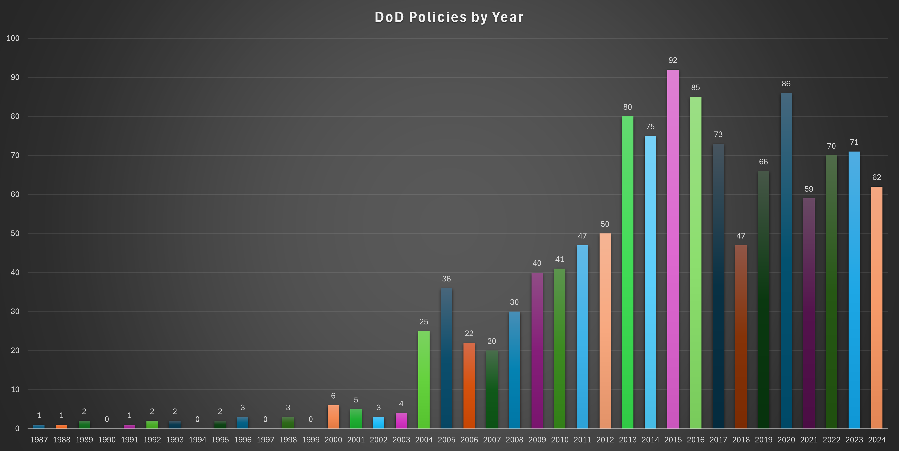
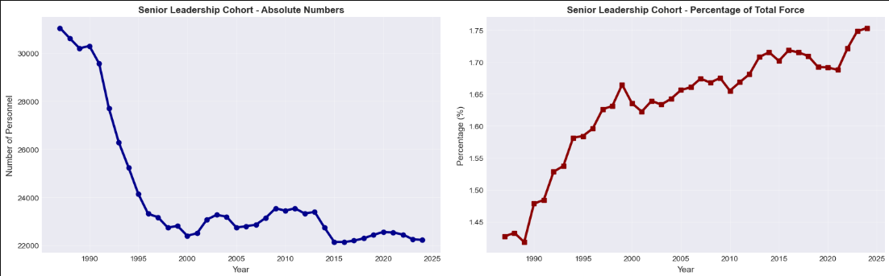
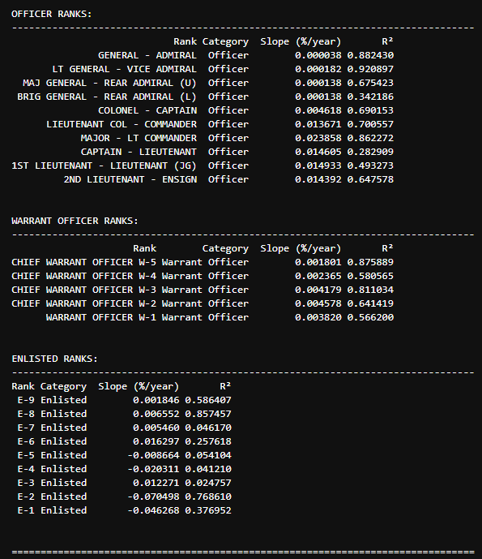

Intent of this repository is to compare multi-dimensional data to demonstrate the change in bureaucracy for the DoD/
DoW since the Goldwater-Nichols act of 1986. This was the last major reorganization of the DoD and the timeline 
that includes relatively easily accessible records. The Goldwater-Nichols act was put in place due to interservice
rivalries and poor communication leading up to, and after the failed "Operation Eagle Claw" in 1980 and continuing
through Operation Urgent Fury in 1983 during the invasion of Grenada.

Plan is to use this data to support and nest within Max Weber's Iron Cage of bureaucracy as well as Robert Michels'
Iron law of Oligarchy to demonstrate how and why DoW is a bureaucracy that can only grow, and how DoW could still
be innovative despite the ever-growing bureaucracy. Also want to identify who the "oligarchs" are (introduce new
term of "demigarch" for those who act like an oligarch but are motivated by helping the organization succeed or
aligned beliefs instead of tradition oligarchs that behave that way out of self-preservation and to increase
wealth/power.

Dimensions of comparison are 
1: leaders to personnel ratios (span of control), 
2: Total number of Policies, manuals, instructions and
directives by year, with volume and clarity of each volume as partial measurements  
3: Decision timelines, 
4: Annual "cya" mandatory training 
5: Number of departments, offices, branchs, etc (organizational complexity)

  

  

  

O-4s (Majors/LT Commanders) are the staff officers of DoD. This rank is between company-level command and field grade command 
These are the bureaucrats, or at least the surface area in most contact with the bureaucracy. This rank being the most
significant for growth is direct evidence of bureaucratic bloat. O-4s are the tail to the enlisted teeth. The lower enlisted 
are the only group with negative relative growth rates. E-3 was actually slightly positive due to nature of the rank and how long 
it it held for initial entry Soldiers and due to the surges in Iraq and Afghanistan resulting in large recruiting volume driving 
up numbers in 2003 and 2010. The coefficient of determination for E-3s reflects the high variability in data.
That being accounted for; all other enlisted below E-6 dropped in relative size so the teeth to tail ratio is skewing towards 
bureaucracy on both ends.

References:

Websites:
https://www.opm.gov/data/datasets/ 
http://dwp.dmdc.osd.mil/dwp/app/dod-data-reports/workforce-reports
https://www.esd.whs.mil/Directives/issuances/dodd/
https://pclt.defense.gov/DIRECTORATES/FOIA/DoD-Annual-Reports-to-AG.aspx
https://comptroller.defense.gov/ODCFO/afr/
https://press.armywarcollege.edu/cgi/viewcontent.cgi?article=1205&context=monographs
https://pclt.defense.gov/DIRECTORATES/FOIA/DoD-Annual-Reports-to-AG.aspx
https://www.govinfo.gov/content/pkg/GOVPUB-D-PURL-gpo53127/pdf/GOVPUB-D-PURL-gpo53127.pdf
http://www.defenselink.mil/odam/omp/pubs/GuideBook/ToC.htm
https://www.rand.org/content/dam/rand/pubs/monograph_reports/2009/MR1253.pdf
https://www.everycrsreport.com/reports/RL31346.html
https://www.esd.whs.mil/Portals/54/Documents/FOID/Reading%20Room/Other/17-F-1349_Document_PAS_Positions_Latest.pdf
https://www.govinfo.gov/content/pkg/GPO-PLUMBOOK-2020/pdf/GPO-PLUMBOOK-2020-8-4-1.pdf

***FOIA Data was really all over the place, some years took the average of the medians of each agency, some years took median of medians,
some years only reported overall media. I used median of medians or overall median when that was all that was available. From 2008
to 2014, the Army was not able to report a median so for them, their mean was used for those years only as it tracked closely in other
years with the median.
